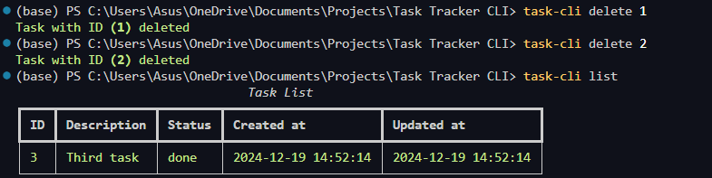

# Task CLI

A command-line interface (CLI) tool for managing tasks efficiently. The Task CLI allows you to create, update, list, delete, and mark tasks as in progress or done, directly from the terminal.

## Features

- **Create**: Add a new task with a description.
- **Update**: Modify an existing task's description.
- **Delete**: Remove a task from the task list.
- **Mark In Progress**: Mark a task as in progress.
- **Mark Done**: Mark a task as completed.
- **List**: View all tasks with their status and details.

## Setup and Installation

To set up the project, follow these steps:

- Note: Python version used to develop this project is **3.11.4**. Adjust it, incase of any issues.

1. **Install the required dependencies**:
   - Change directory to src/dist using :
     
        ```
        cd src/dist
        ```
        
   - Install the `task_cli-0.1.0-py3-none-any.whl` file using `pip`.

   Run the following command in your terminal :
   ```
   pip install task_cli-0.1.0-py3-none-any.whl
   ```

2. **Use the Task CLI**:
    - Guide to use this CLI can be found using :
      
        ```
        task-cli --help
        ```


## Screenshots


